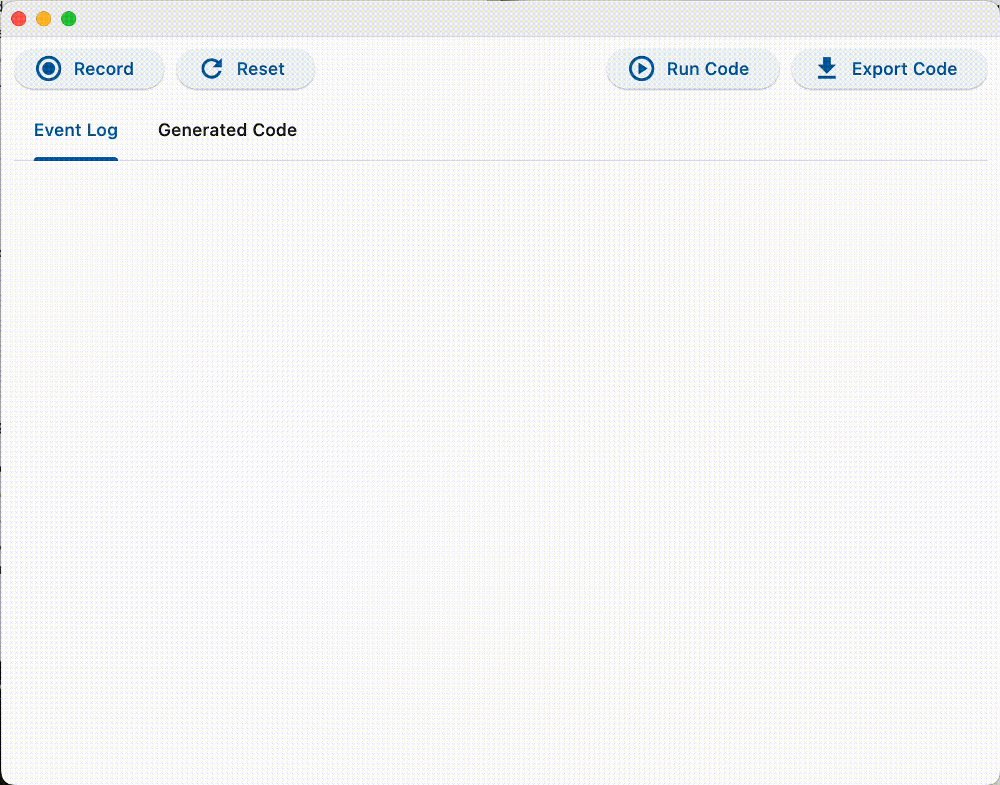

## Demo


## Features

- Record Keyboard and Mouse Inputs: Capture PC inputs from keyboard and mouse operations in real time.
- Reset: Clears all recorded operations, allowing you to start a fresh recording session.
- Run Recorded Operations: Run the recorded sequence of operations as an automated task.
- Export to Python RPA Code: Generate a Python script that automates the recorded operations using the pyautogui library.

## Usage

Run the following commands in your terminal:

```

git clone https://github.com/MySweetEden/operata.git

cd operata

uv sync

python main.py

```

The app provides the following functionalities:

- Record: Start recording keyboard and mouse inputs.
- Reset: Clear all recorded operations to begin a new recording session.
- Run: Execute the recorded operations in sequence.
- Export: Export the recorded sequence to Python RPA code with pyautogui commands, allowing easy modification or further automation.

## Build

You can find more details on publishing here:

https://flet.dev/docs/publish

After setting up your environment, you can use the following command to build the app for your specific operating system:

flet build `<osname>`

Replace `<osname>` with your target operating system (e.g., windows, macos, or linux). This will package the app and create an executable file tailored for your OS, allowing it to be distributed without the need for manual installation of dependencies.

## macOS Setup

You need to grant screen access permissions for the environment you’re using.

- If running in the terminal, allow terminal access.
- If using VS Code, grant access to VS Code.

## Workflow

https://github.com/ndonkoHenri/flet-github-action-workflows/tree/main/.github/workflows
